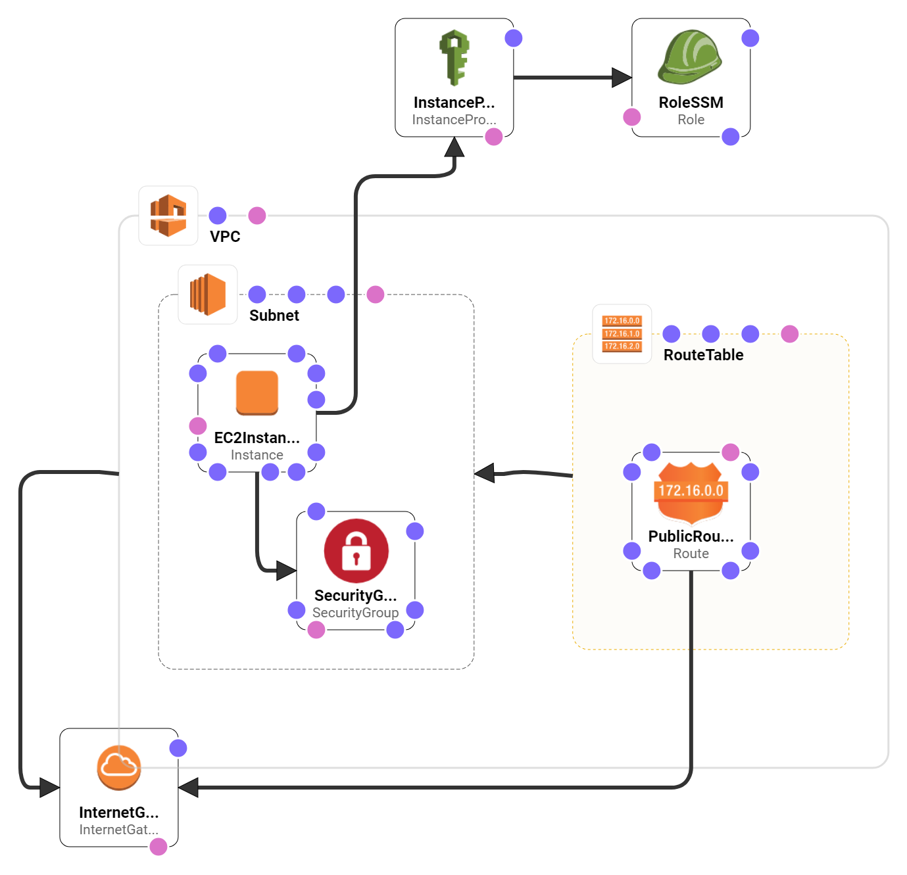

## A demo to copy file from EC2 to S3

When you execute an ad-hoc command on EC2, you might want to store the result file in S3.
A typical example is to run performance tests and save results to a pre-created S3 bucket.

This demo is a barebone to help you crate such a process pipeline, so that you can later add whatever operation, like ad-hoc performance testing, to create a result file to be saved to S3.

## How to run the demo?

### Pre-requisite

- Install AWS CLI, and configure it with an API key/secret having AWS Admin access

### Create Cloudformation Stack, run a remote command on EC2, save the result file in S3

- run `local-commands` from your local PC
  - this will create a Cloudformation stack in your AWS account from the template file in this repository, `ec2-to-s3.cf.yml` 
  - and send an AWS System Manager command to the created EC2 instance within the Cloudformation stack
  - the command executes `remote-ec2-to-s3.sh` on the EC2 instance, and save the resulting file `results.txt` to S3

## Things to note

- [AWS Systems Manager](https://docs.aws.amazon.com/systems-manager/latest/userguide/what-is-systems-manager.html) is needed to execute remote commands on EC2. This is to run arbitrary commands with AWS CLI (i.e.) without using SSH's interactive shell
- [Official video resources for AWS System Manager](https://www.youtube.com/watch?v=zwS8lssaY_k&list=PLhr1KZpdzukeH5jKyYi55ef9tEWAllypB)
- After `local-commands.sh` sent the AWS System Manager command, go to the following page and check the command status:
https://console.aws.amazon.com/ec2/v2/home?#Commands:sort=CommandId

- To run `remote-ec2-to-s3.sh` and `remote-gen-text.sh` on EC2, I needed to change the file permission in the following way:
  - [Look here for details](https://medium.com/@akash1233/change-file-permissions-when-working-with-git-repos-on-windows-ea22e34d5cee).
  - TL;DR
    - `git ls-files --stage` to check
    - `git update-index --chmod=+x 'name-of-shell-script'` to update

## Cloudformation Stack

Illustrated by [Cloudformation Designer](https://console.aws.amazon.com/cloudformation/designer/home):

